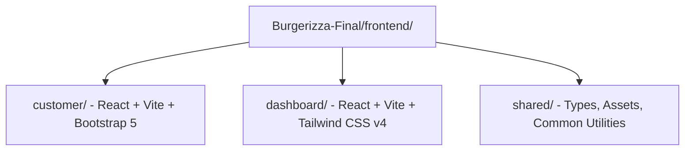

# Frontend Integration Plan

This document outlines the final integration strategy for the frontend of the **Burgerizza SaaS Platform**.

## 1. Architectural Strategy

To prevent CSS framework conflicts and package mismatches, the frontend is divided into two decoupled React applications inside a monorepo-style structure, supported by a shared assets/types directory:

### Why Separate Sub-Applications?
1. **CSS Collision Mitigation**: The Customer App relies on **Bootstrap 5**, while the Manager Dashboard utilizes **Tailwind CSS v4**. Tailwind's CSS reset (Preflight) clashes violently with Bootstrap's reset, causing rendering distortions and layout breaks if compiled in a single bundle.
2. **State & Library Isolation**: The customer app uses **Redux Toolkit** for checkout flows and cart management. The manager dashboard uses **React Query (TanStack Query)** for server state synchronization and optimistic UI updates. Isolation ensures zero runtime pollution.
3. **Optimized Build Bundles**: Isolating user roles keeps initial load times low for mobile customers, while providing a fast development workflow (Vite HMR) for staff.

---

## 2. Shared Assets & Type Systems

To preserve consistency, code that is identical between the applications will live under `frontend/shared/`:

*   **`frontend/shared/types/`**: Unified TypeScript interfaces for `User`, `MenuItem`, `Order`, and `Reservation` models. This prevents models from drifting out of sync.
*   **`frontend/shared/assets/`**: Logos, brand assets, and placeholder images (burgers, pizzas) to ensure visual coherence.
*   **`frontend/shared/utils/`**: Helper methods for formatting currency (EGP), parsing dates, and token storage logic.

---

## 3. Sub-App Component Outlines

### A. Customer App (`frontend/customer`)
*   **Source**: `Feature-Customer/customer`
*   **Theme**: Bootstrap 5 (Dark & Gold palette)
*   **Key Views**:
    *   `Home`: Interactive hero slider, category filters, and featured meals.
    *   `Menu`: Detail filters with instant search.
    *   `Cart & Checkout`: Multi-step address form, item increments, and totals.
    *   `Reservations`: Real-time booking form.
    *   `Profile`: Order history cards and active reservation trackers.

### B. Dashboard App (`frontend/dashboard`)
*   **Source**: Combined `Feature-manager-elhadedy` and `Feature-Admin`
*   **Theme**: Tailwind CSS v4 + React Icons
*   **Key Views**:
    *   `Dashboard Overview`: Live cards (Today's Orders, Revenue, Pending) + Recharts line graph.
    *   `Menu Manager`: Food category grid, availability toggles, and creation modal (with file uploads).
    *   `Order Desk`: Kitchen display table with status transition dropdowns (Pending -> Confirmed -> Preparing -> Ready -> Delivered).
    *   `Reservation Planner`: Seating scheduler and host options.
    *   `Inventory Control`: Ingredient stock list, unit costs, and low stock alert counters.
    *   `Notification Bell`: Real-time toast system for new bookings.
